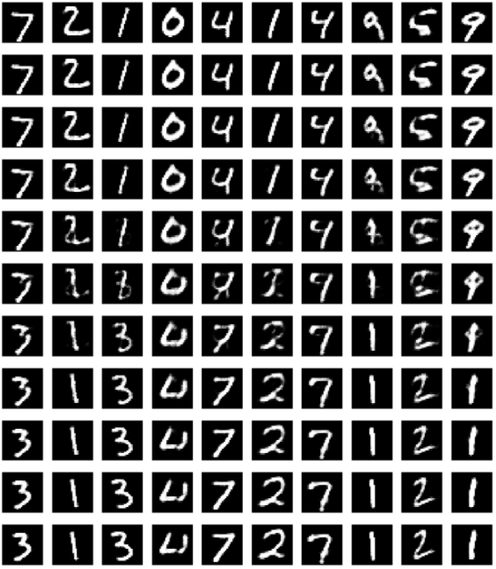
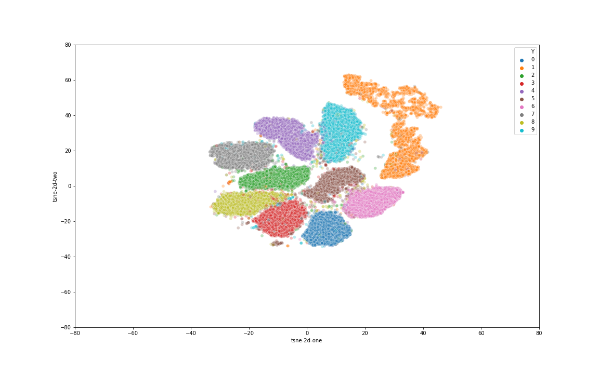
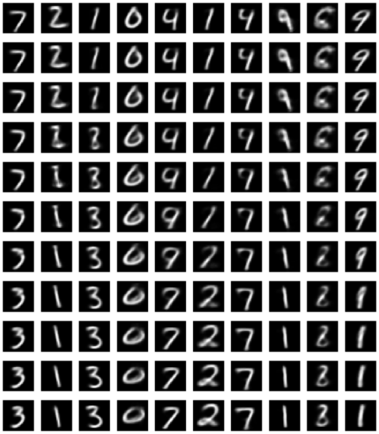
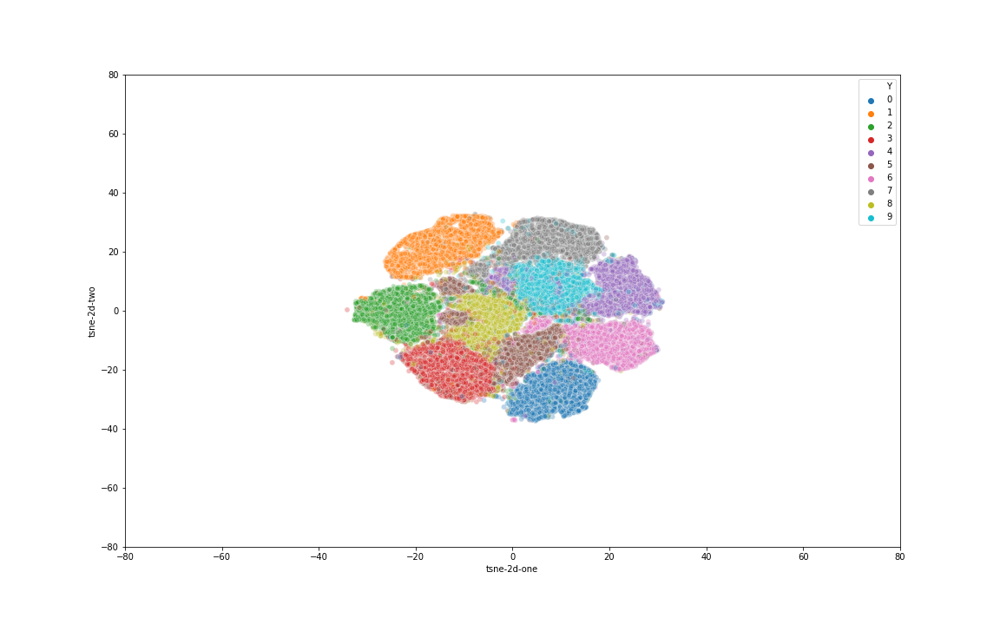

# aae-experiment

- Requirement: pthon3.6, tensorflow 2.3.0 (or above).

### ACAI

Implementation from paper: Understanding and Improving Interpolation in Autoencoders via an Adversarial Regularizer (https://arxiv.org/abs/1807.07543)

#### Running
```
python src/model/mnist_acai.py
```

Alternative run is from [src/notebook/acai-mnist-tf.ipynb](https://github.com/baohq1595/aae-experiment/blob/master/src/notebook/acai_mnist_tf.ipynb)

#### Results

##### Example for interpolation

- Interpolation result with alpha values in range [0,1.0] with step 0.1.
- 1st row and final row are source and destination image, respectively.
- Formula:

```
mix_latent = alpha * src_latent + (1 - alpha) * dst_latent
```



#### Latent space visualization

Below is the visualization of latent space of train data (60k images).



### AAE

Implementation from paper: Adversarial Autoencoders (https://arxiv.org/abs/1511.05644)

#### Running
```
python src/model/mnist_aae.py
```

Alternative run is from [src/notebook/aae-mnist-tf.ipynb](https://github.com/baohq1595/aae-experiment/blob/master/src/notebook/acai_mnist_tf.ipynb)

#### Results

##### Example for interpolation

- Interpolation result with alpha values in range [0,1.0] with step 0.1.
- 1st row and final row are source and destination image, respectively.
- Formula:

```
mix_latent = alpha * src_latent + (1 - alpha) * dst_latent
```



#### Latent space visualization

Below is the visualization of latent space of train data (60k images).


